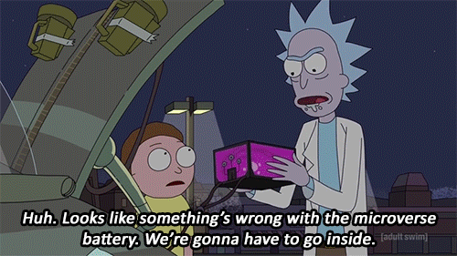

해당 글은 Howard님이 2017/08/`3 에 작성한 [Diving Into The Ethereum VM Part 2](https://medium.com/@hayeah/diving-into-the-ethereum-vm-part-2-storage-layout-bc5349cb11b7) 을 번역한 글입니다. 변역 과정에서 자연스러운 문장을 위해 다소 변경 부분이 존재할 수 있습니다.

* * *

## Part2 - How fixed-length data types are represented

```
contract C {
    uint256 a;
    function C() {
      a = 1;
    }
}
```

위의 contract는 part1에서 확인한 것처럼 "sstore" 명령어를 호출하게 된다.

```
// a = 1
sstore(0x0, 0x1)
```

    - EVM은 storage position "0x0"에 "0x1"을 저장한다.
    - 각 storage position은 32bytes (256 bits)를 저장할 수 있다.

우리는 Solidity가 structs, array와 같이 복잡한 데이터 타입을 가지는 데이터가 32bytes의 저장공간을 어떻게 사용하는지 알아볼 것이다. 또한 storage에 저장될 때 어떻게 최적화 되고 어떻게 저장이 실패하는지도 알아볼 것이다.
전통적인 프로그래밍 언어에서는 데이터 타입이 로우 레벨에서 어떻게 표현되는지 아는 것은 유용하지 않지만 Solidity 또는 다른 EVM 언어에서는 데이터 타입이 어떻게 표현되는지 중요하다. 그 이유는 storage 에 데이터를 저장하고 읽어오는 작업은 매우 비싼 gas가 들기때문이다. (아래는 storage에 접근하는 명령어에 따른 gas 소모량)

    - sstore은 20000 gas, 기본적인 산수 명령어보다 5000배 비싸다.
    - sload는 200 gas, 기본적인 산수 명령어보다 100배 비싸다.

앞으로 우리는 비용에 대해 성능의 속도가 아닌 지불되는 실제 돈(gas)를 가지고 이야기할 것이며, 결국 contract가 동작하는 데 많은 비용을 차지하는 부분은 "sstore", "sload"가 된다.


### Parsecs Upon Parsecs of Tape

Parsecs Upon Parsecs of Tape 에서는 EVM의 동작을 Universal Turing Machine에 비유하여 설명할 것이다.

 Turing Machine. Source : http://raganwald.com/ </img>

Universal Turing Machine을 구축하기 위해서는 아래와 같은 두 가지 필수요소가 존재한다.

    - 점프 또는 재귀를 반복하는 방법(jump or recursion, loop)
    - 무한한 메모리

EVM 어셈블리 코드는 점프, 그리고 EVM storage가 제공하는 무한한 메모리를 가지며 이것으로 이더리움을 시뮬레이팅하기에 충분하다.

<br>Diving Into The Microverse Battery </img>

contract를 위한 EVM storage는 Turing Machine의 무한한 종이 테이프와 같으며, 아래와 같이 테이프의 각 슬롯은 32 bytes를 가진다.

```
[32 bytes][32 bytes][32 bytes]...
```

이제 무한한 테이프(즉, 무한한 storage) 에서 데이터가 어떻게 존재하는지 확인할 것이다.
contract 당 테이프의 길이는 2<sup>256</sup> 또는 10<sup>77</sup> storage 슬롯을 가진다.

### The Blank Tape

storage는 최초에 모두 "0"으로 채워져있다. "0"으로 채워져 있는 경우 어떠한 비용(gas)도 발생하지 않는다. 왜 그런지 "0"(zero-value)가 동작하는 간단한 contract를 살펴보자.

```
pragma solidity ^0.4.11;
contract C {
    uint256 a;
    uint256 b;
         uint256 c;
    uint256 d;
    uint256 e;
    uint256 f;
    function C() {
      f = 0xc0fefe;
    }
}
```

위의 contract는 아래와 같이 간단한 storage 레이아웃을 가진다.

    - a는 storage "0x0"
    - b는 storage "0x1"
    - c는 storage "0x2"
    - d는 storage "0x3"
    - e는 storage "0x4"
    - f는 storage "0x5"

위의 contract에서 살펴볼 핵심내용은 **"만약 우리가 f를 사용했을 때, 사용하지 않는 'a,b,c,d,e'를 위해 얼마의 비용을 지불해야 하는가?"** 이다.
자! 이제 위의 contract를 컴파일 해보자.

```
$ solc --bin --asm --optimize c-many-variables.sol
```

컴파일된 어셈블리 코드의 핵심은 아래와 같다.

```
// sstore(0x5, 0xc0fefe)
tag_2:
  0xc0fefe
  0x5
  sstore
```

위의 어셈블리 코드에서 보는 것과 같이 변수 선언 자체는 비용이 발생하지 않으며, 초기화 또한 필요하지 않다.
이처럼 Solidity는 변수를 위한 storage position을 준비하고, 그 storage position을 접근(사용)할 때만 비용(gas)을 지불하면 된다.
위의 예제의 경우 우리는 f 를 storage position "0x5"에 저장하기 위한 비용만 지불하면 된다.
만약, 직접 어셈블리 코드를 작성하는 경우 더 이상의 storage 확장 없이 어떤 storage postion에 저장할 지 선택할 수 있다.

### Reading Zero


